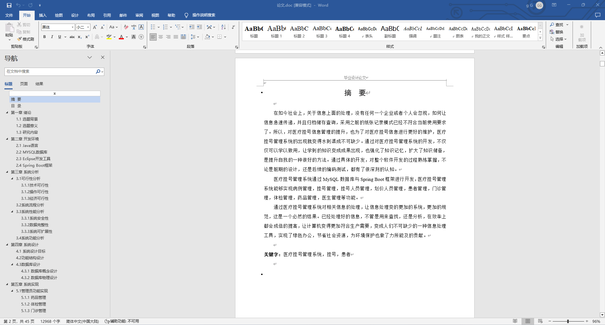
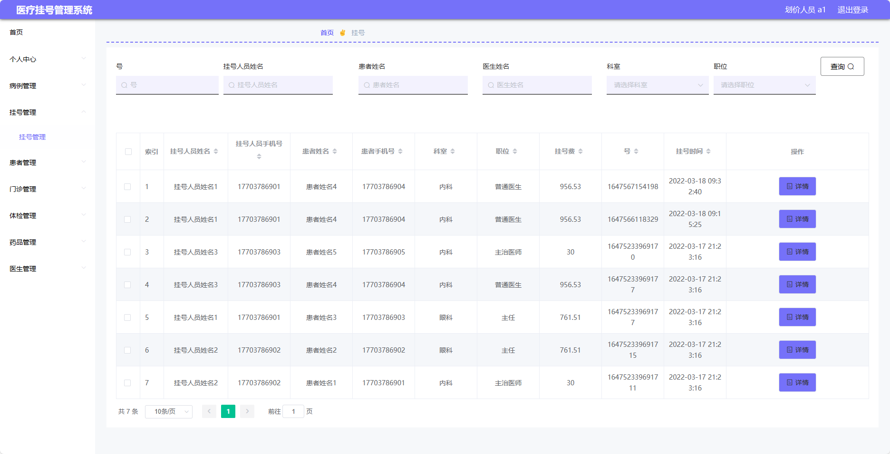
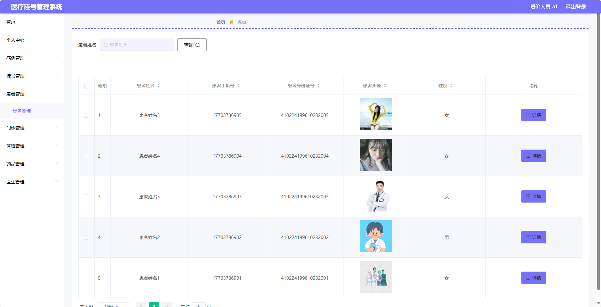
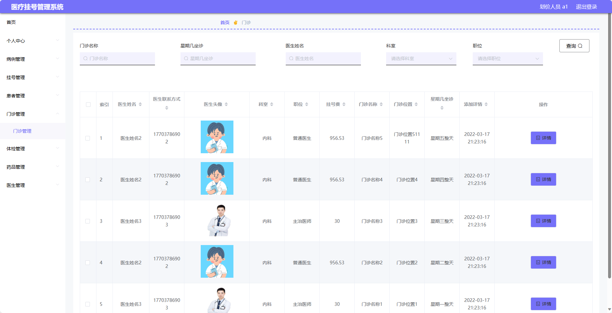
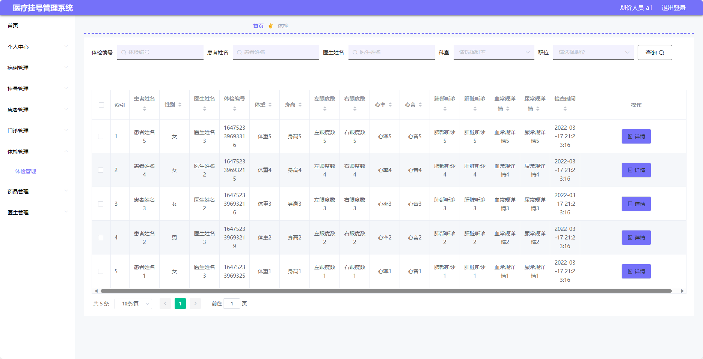
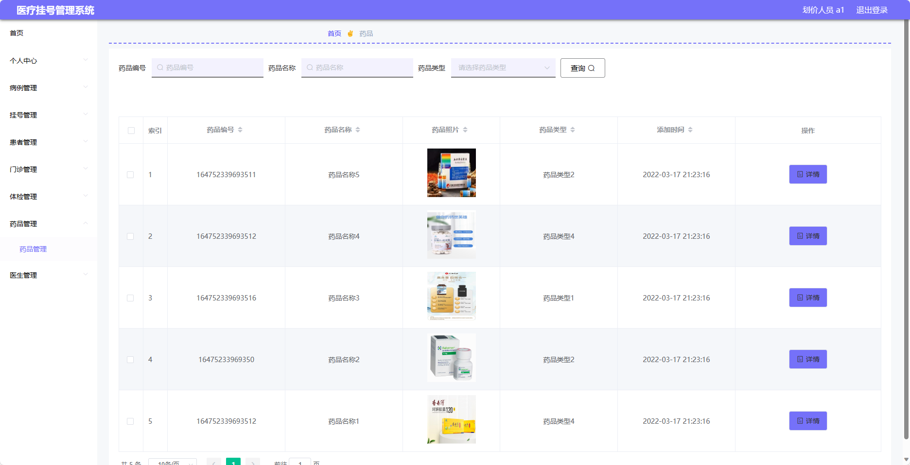
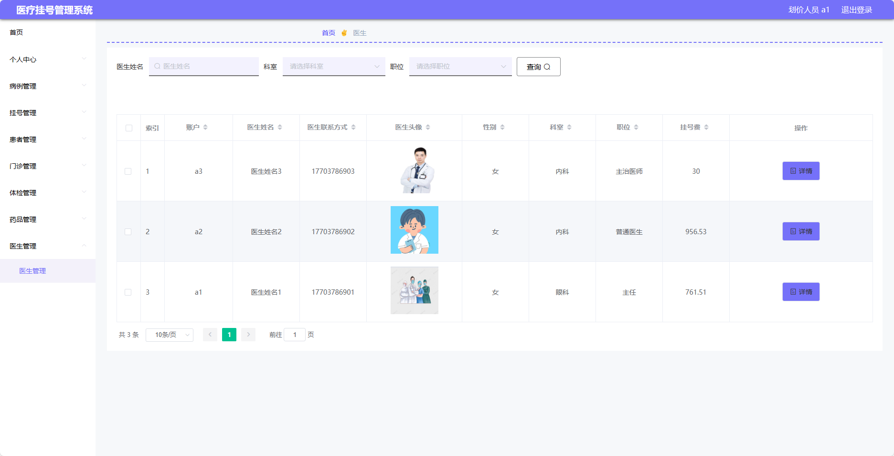
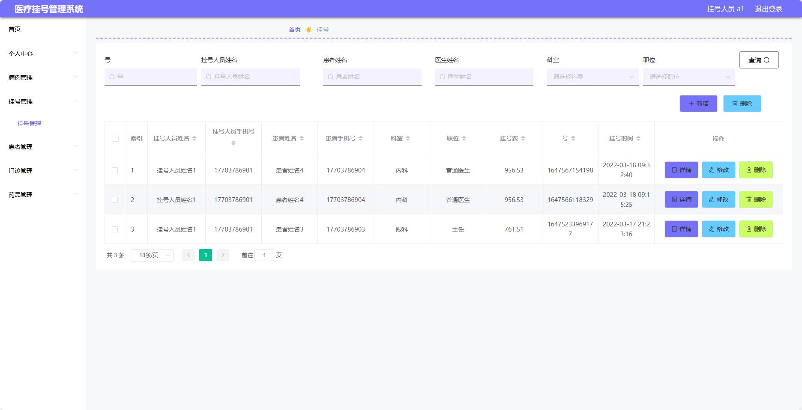
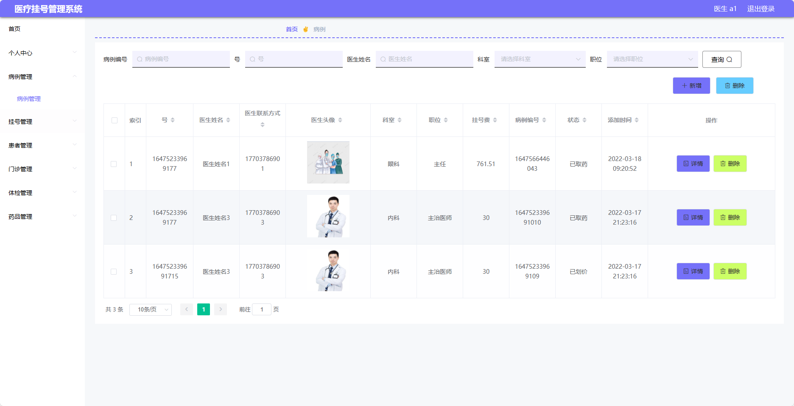

## 基于SpringBoot的医疗挂号管理系统(程序+报告)

- <b>完整代码获取地址：从戎源码网 ([https://armycodes.com/](https://armycodes.com/))</b>
- <b>技术探讨、资料分享，请加QQ群：692619798</b> 
- <b>作者微信：19941326836  QQ：952045282</b> 
- <b>承接计算机毕业设计、Java毕业设计、Python毕业设计、深度学习、机器学习</b>
- <b>选题+开题报告+任务书+程序定制+安装调试+论文+答辩ppt 一条龙服务</b>
- <b>所有选题地址 ([https://github.com/YuLin-Coder/AllProjectCatalog](https://github.com/YuLin-Coder/AllProjectCatalog)) </b>

## 项目介绍
基于SpringBoot的医疗挂号管理系统，系统包含四种角色：管理员、医生、挂号人员、划价人员	,系统分为前台和后台两大模块，主要功能如下

### 【管理员】:
- 个人中心：管理个人信息。
- 基础数据管理：管理系统中的基础数据，包括科室信息、医生信息等。
- 病例管理：管理患者的病例信息，包括病历记录、诊断结果等。
- 挂号管理：管理患者的挂号信息，包括挂号记录、退号操作等。
- 挂号人员管理：管理系统中的挂号人员信息，包括添加、编辑、删除挂号人员等操作。
- 划价人员管理：管理系统中的划价人员信息，包括添加、编辑、删除划价人员等操作。
- 患者管理：管理系统中的患者信息，包括添加、编辑、删除患者等操作。
- 门诊管理：管理门诊的相关信息，包括门诊科室、医生排班等。
- 体检管理：管理患者的体检信息，包括体检记录、结果等。
- 药品管理：管理系统中的药品信息，包括添加、编辑、删除药品等操作。
- 医生管理：管理系统中的医生信息，包括添加、编辑、删除医生等操作。

### 划价人员：
- 个人中心：管理个人信息。
- 病例管理：管理患者的病例信息，包括病历记录、诊断结果等。
- 挂号管理：管理患者的挂号信息，包括挂号记录、退号操作等。
- 患者管理：管理系统中的患者信息，包括添加、编辑、删除患者等操作。
- 门诊管理：管理门诊的相关信息，包括门诊科室、医生排班等。
- 体检管理：管理患者的体检信息，包括体检记录、结果等。
- 药品管理：管理系统中的药品信息，包括添加、编辑、删除药品等操作。
- 医生管理：管理系统中的医生信息，包括添加、编辑、删除医生等操作。

### 挂号人员：
- 个人中心：管理个人信息。
- 病例管理：管理患者的病例信息，包括病历记录、诊断结果等。
- 挂号管理：管理患者的挂号信息，包括挂号记录、退号操作等。
- 患者管理：管理系统中的患者信息，包括添加、编辑、删除患者等操作。
- 门诊管理：管理门诊的相关信息，包括门诊科室、医生排班等。
- 药品管理：管理系统中的药品信息，包括添加、编辑、删除药品等操作。

### 医生：
- 个人中心：管理个人信息。
- 病例管理：管理患者的病例信息，包括病历记录、诊断结果等。
- 挂号管理：管理患者的挂号信息，包括挂号记录、退号操作等。
- 患者管理：管理系统中的患者信息，包括添加、编辑、删除患者等操作。
- 门诊管理：管理门诊的相关信息，包括门诊科室、医生排班等。
- 体检管理：管理患者的体检信息，包括体检记录、结果等。
- 药品管理：管理系统中的药品信息，包括添加、编辑、删除药品等操作。

## 项目技术
- 编程语言：Java
- 数据库：MySQL
- 项目管理工具：Maven
- 前端技术：HTML、CSS、JavaScript、Jquery、Vue
- 后端技术：Spring、SpringMVC、MyBatis

## 运行环境
- JDK版本：JDK1.8及以上
- 开发工具：IDEA、Ecplise、Myecplise都可以
- 数据库: MySQL5.7及以上
- Maven：maven3.0及以上
- Node：14.14.0及以上

## 运行截图

